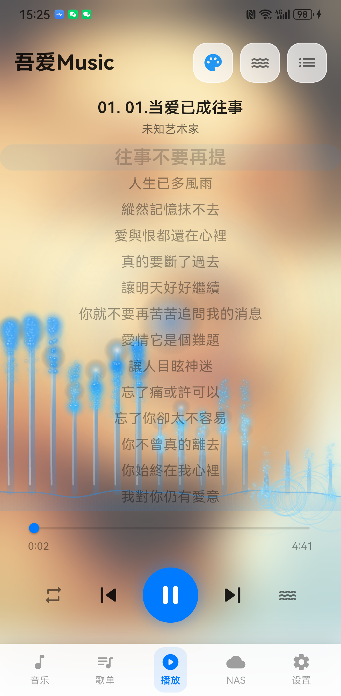
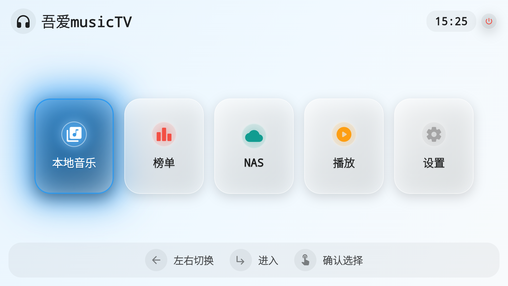

# 吾爱Music

一款基于 Flutter 开发的跨平台音乐播放器，支持手机和 Android TV，具备毛玻璃 UI 设计风格。

## 功能特性

### 播放器
- 本地音乐播放（支持 mp3、flac、wav、ogg 等格式）
- 播放/暂停/上一首/下一首/进度控制
- 后台播放 + 通知栏控制
- 均衡器 (EQ)
- 播放模式：顺序/随机/单曲循环

### 在线音源
- 网易云音乐 API 接入（手机号/二维码登录、歌单同步、在线搜索）
- QQ音乐榜单数据同步
- 自定义音源导入（JS 插件）

### NAS 集成
- SMB 协议连接 NAS 设备
- 自动扫描 NAS 音乐目录
- NAS 音乐无缝播放（自动缓存到本地）

### 歌词
- LRC 歌词解析与同步显示
- 本地 .lrc 文件优先读取
- 在线歌词搜索下载

### 元数据修复
- 自动识别并下载专辑封面
- 批量修复歌曲元数据

### UI 设计
- 毛玻璃 (Glassmorphism) 风格 UI
- 20+ 预设配色方案
- 浅色/深色/跟随系统主题
- 手机端 + TV 端自适应（自动检测设备类型）
- TV 端遥控器 D-pad 焦点导航

## 截图

| 手机端 | TV 端 |
|:---:|:---:|
|  |  |

## 技术栈

| 类别 | 技术 |
|------|------|
| 框架 | Flutter |
| 语言 | Dart |
| 状态管理 | Riverpod |
| 音频播放 | just_audio |
| 网络请求 | Dio |
| NAS 连接 | smb_connect |
| 本地存储 | SharedPreferences |
| 图标 | Phosphor Icons |

## 快速开始

### 环境要求

- Flutter >= 3.24.0
- Dart >= 3.5.0
- Android SDK (API 24+)

### 安装步骤

1. 克隆仓库
```bash
git clone https://github.com/jim-6688/wuai-music.git
cd wuai-music
```

2. 安装依赖
```bash
flutter pub get
```

3. 配置在线音源（可选）

复制配置文件模板并填入你的 API 地址：
```bash
cp config/api_config.example.json config/api_config.json
```

4. 运行
```bash
flutter run
```

### 构建 APK

```bash
flutter build apk --release
```

构建产物位于 `build/app/outputs/flutter-apk/app-release.apk`

## 项目结构

```
lib/
├── main.dart                          # 应用入口
├── core/
│   ├── providers/                     # 全局 Provider
│   │   ├── unified_tracks_provider.dart   # 统一音乐列表（本地+NAS）
│   │   └── player_integration_provider.dart
│   ├── theme/                         # 主题系统
│   └── utils/                         # 工具类
├── features/
│   ├── player/                        # 播放器功能
│   ├── files/                         # 本地音乐管理
│   ├── nas/                           # NAS 连接与管理
│   ├── playlist/                      # 歌单 & 在线音源
│   │   ├── services/
│   │   │   ├── meting_api_client.dart     # Meting API
│   │   │   ├── netease_api_service.dart   # 网易云 API
│   │   │   ├── netease_leaderboard_service.dart  # 榜单服务
│   │   │   └── qq_music_leaderboard_service.dart  # QQ音乐榜单
│   │   └── providers/
│   ├── settings/                      # 设置页面
│   ├── beautify/                      # 元数据修复
│   ├── extension_manager/             # 扩展功能管理
│   └── tv/                            # TV 端适配页面
│       ├── presentation/pages/
│       └── widgets/
└── shared/
    ├── navigation/                    # 导航控制
    └── widgets/                       # 共享组件（毛玻璃等）
```

## 贡献

欢迎提交 Issue 和 Pull Request！

## 许可证

MIT License

## ☕ 支持与赞助

如果这个项目对你有帮助，欢迎请作者喝杯咖啡 ☕

| 支付宝 | 微信 |
|:---:|:---:|
|  |  |

你的支持是持续开发的动力，感谢每一位赞助者！

## 致谢

本程序基于 **[QCLaw](https://github.com/nicepkg/qclaw)** 及 **[WorkBuddy](https://www.codebuddy.cn)** 协助开发完成。

特别感谢：
- **[QCLaw](https://github.com/nicepkg/qclaw)** — AI 驱动的开发辅助工具，为本项目提供了强大的代码生成与重构能力
- **[WorkBuddy](https://www.codebuddy.cn)** 及其项目组 — 提供了全方位的 AI 协作开发支持，涵盖代码编写、调试、构建和发布全流程

感谢以上开源项目对本程序开发的帮助与支持！

- [Flutter](https://flutter.dev)
- [just_audio](https://pub.dev/packages/just_audio)
- [Riverpod](https://riverpod.dev)
- [Phosphor Icons](https://phosphoricons.com)
